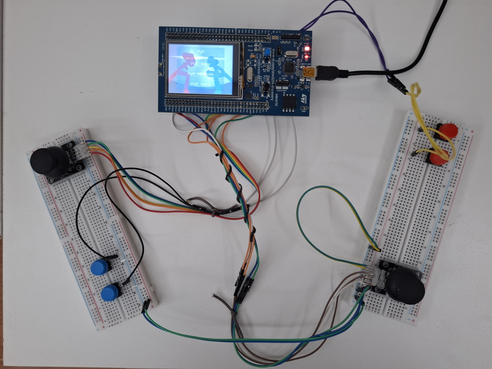
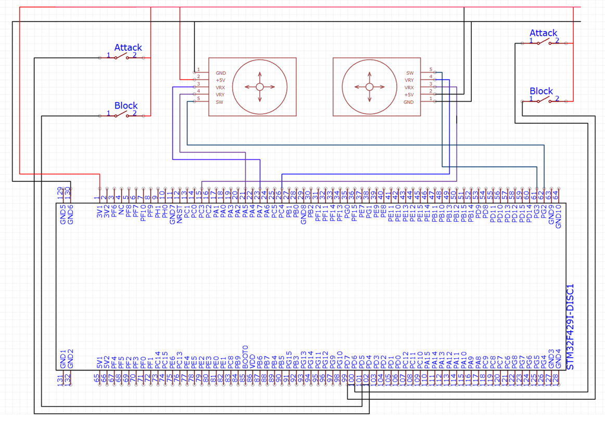
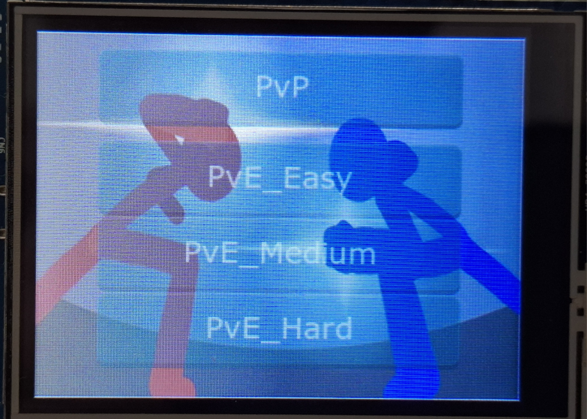
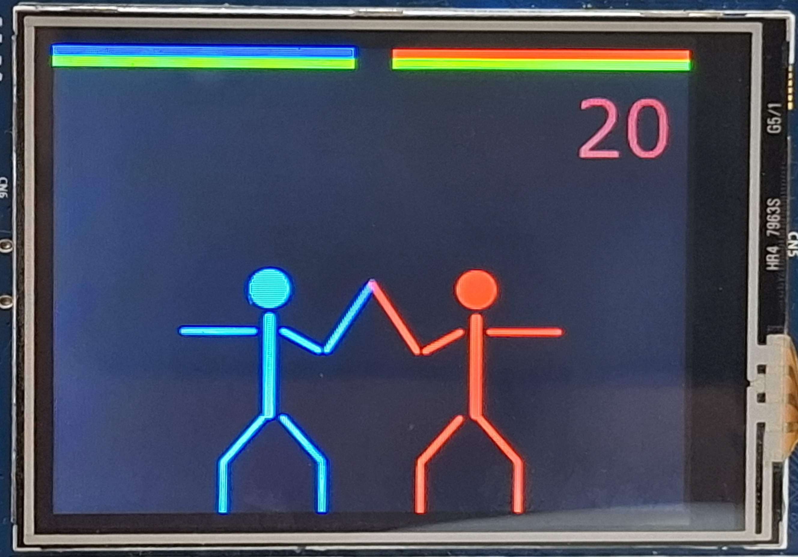
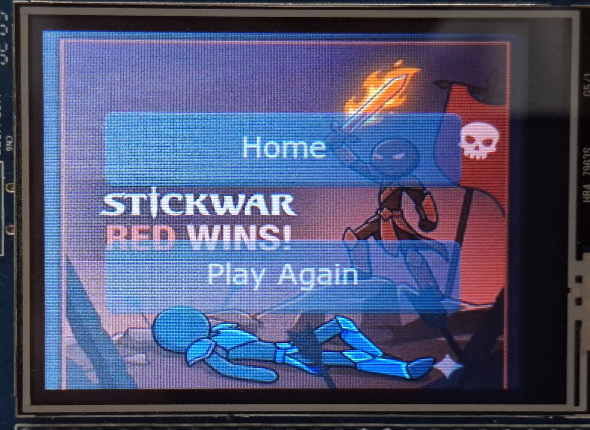

# STM32 STICKWAR
> Game đối kháng stickman chạy trên vi điều khiển STM32F429I Discovery

## GIỚI THIỆU

**Đề bài/Mục tiêu sản phẩm** : Xây dựng một trò chơi điện tử đối kháng chạy trực tiếp trên vi điều khiển STM32F429I Discovery, sử dụng màn hình LCD tích hợp và các ngoại vi nút bấm, joystick để điều khiển. [Xem mô tả gốc](original-description.md)

**Hướng tiếp cận**: Người chơi tương tác thông qua joystick analog (di chuyển, nhảy, khom) và nút bấm digital (tấn công, đỡ đòn) cùng nút SW tích hợp trong joystick (ultimate). Đồ họa nhân vật hình que (stickman) được vẽ bằng Line widget của TouchGFX. Logic game chạy trong FreeRTOS với 2 task song song: một task đọc phần cứng, một task render và xử lý game.

**Sản phẩm:**
1. Chế độ PvP (Player vs Player): 2 người chơi dùng joystick + nút bấm riêng
2. Chế độ PvE (Player vs Environment): 1 người chơi đối với bot AI 3 mức độ (Easy / Medium / Hard)
3. Hệ thống chiến đấu đầy đủ: punch, kick, block, dodge, ultimate, stamina, stun, crit (Screen1)
4. Màn hình chọn chế độ chơi (Screen2) và màn hình kết quả (Screen3)
5. Đồng hồ đếm ngược 60 giây, thắng/thua theo HP hoặc hết giờ so HP  
- Ảnh chụp minh họa:\


## TÁC GIẢ

- Tên nhóm: **AHEHE**
- Thành viên trong nhóm: 

  | STT | Họ tên | MSSV | Công việc |
  | --: | -- | -- | -- |
  | 1 | Nguyễn Tuấn Anh | 20235264 | Xây dựng cốt lõi game, game designer |
  | 2 | Hoàng Khắc Tiến | 20225414 | Nút B1: logic chọn chế độ chơi |
  | 3 | Hoàng Anh Tú  | 20220055  | Countdown 3-2-1 FIGHT, hiệu ứng hit flash |
  | 4 | Trần Quang Huy | 20225339 | Timer đếm ngược 60 giây xử lý kết thúc game |
  | 5 | Hồ Văn Hải | 20225306 | Quản lý mã nguồn, tái cấu trúc StickManA/B → StickMan |

## MÔI TRƯỜNG HOẠT ĐỘNG

- **CPU/Dev kit**: STM32F429I Discovery (STM32F429ZIT6, Cortex-M4, 180 MHz)
- **Màn hình**: LCD TFT 240×320 tích hợp sẵn trên kit
- **Framework**: TouchGFX, FreeRTOS, STM32 HAL

  **Bill of materials**

  | STT | Tên linh kiện | Ý nghĩa |
  | -- | -- | -- |
  | 1 | STM32F429I Discovery | Vi điều khiển trung tâm + màn hình LCD 240×320 tích hợp |
  | 2 | Joystick analog × 2 | Điều khiển di chuyển Player A & B (trục X/Y) + nút SW Ultimate |
  | 3 | Nút bấm digital × 4 | Attack và Block cho mỗi player |
  | 4 | Nút B1 (PA0) | Chọn và xác nhận chế độ chơi |

## SƠ ĐỒ SCHEMATIC

  

| STM32F429 | Ngoại vi | Ý nghĩa |
| -- | -- | -- |
| PA5 (ADC1_CH5) | Joystick A – trục X | ADC đọc vị trí ngang Player A |
| PA7 (ADC1_CH7) | Joystick A – trục Y | ADC đọc vị trí dọc Player A |
| PC3 (ADC1_CH13) | Joystick B – trục X | ADC đọc vị trí ngang Player B |
| PC4 (ADC1_CH14) | Joystick B – trục Y | ADC đọc vị trí dọc Player B |
| PG2 | SW Joystick A (nhấn cần) | Ultimate Player A |
| PG3 | SW Joystick B (nhấn cần) | Ultimate Player B |
| PD4 | Nút bấm rời | Attack BTN Player A |
| PD5 | Nút bấm rời | Block BTN Player A |
| PD6 | Nút bấm rời | Attack BTN Player B |
| PD7 | Nút bấm rời | Block BTN Player B |
| PA0 | Nút B1 trên board | Chọn chế độ chơi |

## TÍCH HỢP HỆ THỐNG

### Phần cứng
| Thành phần | Vai trò |
| -- | -- |
| STM32F429ZIT6 | Vi điều khiển trung tâm, chạy toàn bộ game logic |
| ADC1 (4 kênh) | Đọc vị trí 2 joystick analog liên tục |
| DMA2 Stream0 | Tự động chuyển kết quả ADC → RAM, CPU không cần can thiệp |
| TIM6 | Cung cấp HAL_GetTick() để đo thời gian |
| Màn hình | Màn hình hiển thị tích hợp sẵn trên kit |
| 4 Digital Button | Button điều khiến nhân vật |
| 2 Joystick | Joystick diều khiến nhân vật |
| Breadboard + dây nối | Tạo mạch kết nối phần cứng giữa các thiết bị |

### Phần mềm

| Thành phần | Nằm trên | Vai trò |
| -- | -- | -- |
| `defaultTask` (FreeRTOS) | STM32 – `Core/Src/main.c` | Đọc ADC (joystick) + GPIO (nút bấm) mỗi 50ms, gửi lệnh vào Queue |
| `GUI_Task` (TouchGFX) | STM32 – `TouchGFX/` | Vòng lặp render 60fps, logic game, AI |
| `Queue1Handle` (FreeRTOS Queue) | STM32 – RAM | Giao tiếp thread-safe giữa defaultTask và GUI_Task (20 × uint8_t) |
| `StickMan` (TouchGFX Container) | STM32 – `TouchGFX/gui/` | Class nhân vật: state machine, animation, damage |
| `Screen1View` | STM32 – `TouchGFX/gui/` | Điều phối trận đấu, phát hiện va chạm, AI logic |
| `Screen2View` | STM32 – `TouchGFX/gui/` | Menu chọn chế độ (touch + nút B1) |
| `Screen3View` | STM32 – `TouchGFX/gui/` | Hiển thị kết quả thắng/thua |

## ĐẶC TẢ HÀM

### [`Core/Src/main.c`](../Core/Src/main.c) — `StartDefaultTask()`

**Joystick ADC → Lệnh di chuyển** (gửi mỗi 50ms hoặc khi đổi hướng):

```c
if (xy_val[1] > 3000)       current_cmd_A = 'L';
else if (xy_val[1] < 1000)  current_cmd_A = 'R';
else if (xy_val[0] > 3000)  current_cmd_A = 'C';
else if (xy_val[0] < 1000)  current_cmd_A = 'J';
else                        current_cmd_A = 'S';

if (current_cmd_A == 'S') {
    if (last_cmd_A != 'S') {
        osMessageQueuePut(Queue1Handle, &current_cmd_A, 0, 10);
        last_cmd_A = 'S';
    }
} else {
    if ((current_cmd_A != last_cmd_A) || (current_time - send_timer_A >= 50)) {
        osMessageQueuePut(Queue1Handle, &current_cmd_A, 0, 10);
        last_cmd_A = current_cmd_A;
        send_timer_A = current_time;
    }
}
```

**Lệnh Tấn công** (PD4):

```c
if (curr_A_Atk != last_A_Atk) {
    if (curr_A_Atk == GPIO_PIN_SET) {
        press_time_A = current_time;
    } else {
        uint32_t hold_time = current_time - press_time_A;
        if (current_cmd_A == 'C' || current_cmd_A == 'J')
            data = (hold_time > 400) ? 'X' : 'K';  // Đá mạnh / nhẹ
        else
            data = (hold_time > 400) ? 'H' : 'A';  // Đánh trên mạnh / nhẹ
        osMessageQueuePut(Queue1Handle, &data, 0, 10);
    }
    last_A_Atk = curr_A_Atk;
}
```

**Lệnh Ultimate - Nút SW** (PG2):

```c
if (curr_A_SW != last_A_SW) {
    osDelay(20);
    if (curr_A_SW != last_A_SW) {
        data = (curr_A_SW == GPIO_PIN_RESET) ? 'W' : 'U';  // Nhấn: tích lực / Nhả: lao đi
        osMessageQueuePut(Queue1Handle, &data, 0, 10);
        last_A_SW = curr_A_SW;
    }
}
```
---
### [`StickMan.cpp`](../TouchGFX/gui/src/containers/StickMan.cpp)

**`processCommand()` — FSM tấn công, block & ultimate:**

```cpp
case 'A':
    if (cooldownTimer == 0 && stamina >= 10) {
        currentState = STATE_ATTACK_L;
        stamina -= 10; stateTimer = 0; cooldownTimer = 20;
    }
    break;
case 'W':
    if (cooldownTimer == 0 && stamina >= 80) {
        currentState = STATE_ULTIMATE_CHARGE;
        stamina -= 80; stateTimer = 0;
    }
    break;
case 'U':
    if (currentState == STATE_ULTIMATE_CHARGE) {
        currentState = STATE_ULTIMATE_DASH;
        stateTimer = 0; cooldownTimer = 120;
    }
    break;
```

**`tickProcess()` — Xử lý hit flash:**

```cpp
const bool hitFlashActive = hitFlashTimer > 0;
const touchgfx::colortype activeColor = hitFlashActive
    ? ((hitFlashTimer % 2 == 0) ? flashColor : HIT_FLASH_WHITE)
    : baseColor;
HeadPainter.setColor(activeColor);
// ... (áp lên tất cả painter)
if (hitFlashTimer > 0) hitFlashTimer--;
```

**`tickProcess()` — Nhảy:**

```cpp
if (isJumping) {
    jumpTimer++;
    if (jumpTimer <= 15)       setY(getY() - 6);   // Bay lên
    else if (jumpTimer <= 30)  setY(getY() + 6);   // Rơi xuống
    else { setY(containerOrigY); isJumping = false; }
}
```

**`tickProcess()` — hoạt ảnh Ultimate Dash:**

```cpp
else if (currentState == STATE_ULTIMATE_DASH) {
    Arm2.setEnd(armOrigEndX + dir * 50, armOrigEndY);
    Arm2.setLineWidth(15);
    if (stateTimer <= 20) {
        int newX = getX() + dir * 5;  // Lướt 5px/frame × 20 frame = 100px
        if (facingRight) { if (newX > rightEdge) newX = rightEdge; }
        else             { if (newX < leftEdge)  newX = leftEdge; }
        setX(newX);
    } else {
        Arm2.setLineWidth(3);
        currentState = STATE_IDLE;
    }
}
```

**`takeDamage()`**

```cpp
void StickMan::takeDamage(int dmg, bool causeStun)
{
    hitFlashTimer = 6;
    hp -= dmg;
    if (hp <= 0) {
        hp = 0;
        currentState = STATE_DEAD;
    } else {
        if (causeStun) {
            currentState = STATE_STUNNED;
            stateTimer = 0;
        }
    }
}
```

---

### [`Screen1View.cpp`](../TouchGFX/gui/src/screen1_screen/Screen1View.cpp)

**`handleTickEvent()` — countdown 3-2-1 FIGHT:**

```cpp
if (countdownTimer > 120)
    countdownLabel.setTypedText(TypedText(T___SINGLEUSE_ZSL3));       // "3"
else if (countdownTimer > 60)
    countdownLabel.setTypedText(TypedText(T___SINGLEUSE_Q67O));       // "2"
else
    countdownLabel.setTypedText(TypedText(T___SINGLEUSE_COUNTDOWN_1));// "1"

countdownTimer--;
if (countdownTimer == 0) {
    fightTimer = COUNTDOWN_FIGHT_FRAMES;  // 15 frame
    countdownLabel.setTypedText(TypedText(T___SINGLEUSE_COUNTDOWN_FIGHT)); // "FIGHT!"
}
// Sau fightTimer về 0: countdownLabel.setVisible(false); inputBlocked = false;
```

**`handleTickEvent()` — timer 60s + kết thúc hết giờ:**

```cpp
tickCounter++;
if (tickCounter >= 60) {
    tickCounter = 0;
    if (matchTimer > 0) {
        matchTimer--;
        Unicode::snprintf(txtMatchTimerBuffer, TXTMATCHTIMER_SIZE, "%d", matchTimer);
        txtMatchTimer.invalidate();
    }
    if (matchTimer <= 0) {
        global_winner = (playerA.getHp() >= playerB.getHp()) ? 1 : 2;
        application().gotoScreen3ScreenNoTransition();
        return;
    }
}
```

**`handleTickEvent()` — hitbox, crit, stun (phe A đánh phe B):**

```cpp
if (playerA.getStateTimer() == hitFrame && distance <= attackRange) {
    bool isDodged = false;
    if ((stateA == STATE_ATTACK_L || stateA == STATE_ATTACK_H) && crouchB && !jumpB) isDodged = true;
    if ((stateA == STATE_KICK_L   || stateA == STATE_KICK_H)   && jumpB)             isDodged = true;

    if (!isDodged) {
        if (stateB == STATE_BLOCKING && stateA != STATE_ULTIMATE_DASH) {
            int chipDmg = (stateA == STATE_ATTACK_H || stateA == STATE_KICK_H) ? 2 : 0;
            if (chipDmg > 0) playerB.takeDamage(chipDmg, false);
        } else {
            int dmg = 4;
            if (stateA == STATE_ATTACK_H || stateA == STATE_KICK_H) dmg = 10;
            if (stateA == STATE_ULTIMATE_DASH)                       dmg = 30;
            if (fake_random_counter % 5 == 0 && stateA != STATE_ULTIMATE_DASH) dmg += 4; // Crit
            bool willStun = !crouchA &&
                (stateA == STATE_ATTACK_L || stateA == STATE_ATTACK_H ||
                 stateA == STATE_KICK_L   || stateA == STATE_KICK_H);
            playerB.takeDamage(dmg, willStun);
        }
    }
}
```

**`handleTickEvent()` — AI bot tiếp cận & tấn công:**

```cpp
int actionThreshold = (botDifficulty == 1) ? 80 : (botDifficulty == 3) ? 30 : 50;
int guardBreakThreshold = (botDifficulty == 1) ? 25 : (botDifficulty == 3) ? 8 : 15;

if (distance > 110)                playerB.processCommand('L');
else if (fake_random_counter % 5 == 0) playerB.processCommand('R');

if (distance <= 110 && botActionTimer >= actionThreshold && playerB.getStamina() > 20) {
    if (playerBlockTimer >= guardBreakThreshold) {
        playerB.processCommand('H');  // Phá đỡ
    } else if (botDifficulty >= 2 && playerB.getStamina() >= 80 && (fake_random_counter % 6 == 0)) {
        playerB.processCommand('W');  // Ultimate
    } else {
        int r = fake_random_counter % 6;
        const char moves[] = {'A','H','K','J','B','C'};
        playerB.processCommand(moves[r]);
    }
}
```

---

### [`Screen2View.cpp`](../TouchGFX/gui/src/screen2_screen/Screen2View.cpp)

**`handleTickEvent()` — highlight nút B1 bằng ClickEvent giả:**

```cpp
if (global_pendingMode == 0xFF) {
    // Xác nhận: áp chế độ và chuyển màn hình
    global_isPvE = (current_highlight_mode != 1);
    if (current_highlight_mode == 2) global_botDifficulty = 1;
    else if (current_highlight_mode == 3) global_botDifficulty = 2;
    else if (current_highlight_mode == 4) global_botDifficulty = 3;
    application().gotoScreen1ScreenNoTransition();
} else if (global_pendingMode != 0 && global_pendingMode != current_highlight_mode) {
    current_highlight_mode = global_pendingMode;
    touchgfx::ClickEvent cancelEvent(touchgfx::ClickEvent::CANCEL, 0, 0);
    pvp.handleClickEvent(cancelEvent);       // Bỏ highlight cũ
    pve_easy.handleClickEvent(cancelEvent);
    // ...
    touchgfx::ClickEvent pressEvent(touchgfx::ClickEvent::PRESSED, 0, 0);
    if (current_highlight_mode == 1) pvp.handleClickEvent(pressEvent); // Highlight mới
    // ...
}
```

**`buttonClickHandler()` — Chạm - chọn chế độ:**

```cpp
void Screen2View::buttonClickHandler(const AbstractButton& src)
{
    if      (&src == &pvp)        { global_isPvE = false; }
    else if (&src == &pve_easy)   { global_isPvE = true; global_botDifficulty = 1; }
    else if (&src == &pve_medium) { global_isPvE = true; global_botDifficulty = 2; }
    else if (&src == &pve_hard)   { global_isPvE = true; global_botDifficulty = 3; }
    application().gotoScreen1ScreenNoTransition();
}
```

---

### [`Screen3View.cpp`](../TouchGFX/gui/src/screen3_screen/Screen3View.cpp)

**`handleTickEvent()` — Fade-in ảnh kết quả rồi hiện nút:**

```cpp
if (animationStep == 0) {
    Image& winImage = (global_winner == 1) ? bluewin : redwin;
    int newAlpha = winImage.getAlpha() + 3;
    if (newAlpha >= 255) { winImage.setAlpha(255); animationStep = 1; }
    else                   winImage.setAlpha(newAlpha);
    winImage.invalidate();
} else if (animationStep == 1) {
    int newAlpha = home.getAlpha() + 3;
    if (newAlpha >= 150) {
        home.setAlpha(150); playagain.setAlpha(150);
        home.setTouchable(true); playagain.setTouchable(true);
        animationStep = 2;
    } else {
        home.setAlpha(newAlpha); playagain.setAlpha(newAlpha);
    }
    home.invalidate(); playagain.invalidate();
}
```

**`buttonClickHandler()`:**

```cpp
void Screen3View::buttonClickHandler(const AbstractButton& src)
{
    if (&src == &home)      application().gotoScreen2ScreenNoTransition(); // Về menu
    else if (&src == &playagain) application().gotoScreen1ScreenNoTransition(); // Chơi lại
}
```

---

## KẾT QUẢ
              
**Phần cứng tổng quan:**\


**Màn hình chọn chế độ (Screen2)** — chọn PvP / Easy / Medium / Hard bằng cảm ứng hoặc nút B1:\


**Màn hình trận đấu (Screen1)** — 2 stickman chiến đấu, thanh HP, stamina, đồng hồ 60 giây:\


**Màn hình kết quả (Screen3)** — hiển thị người thắng, nút Play Again:\

